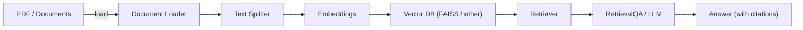

# RAG — Setup & Usage

Retrieval-Augmented Generation (RAG) combines a retrieval system (a vector search over document embeddings) with a generative language model. The retriever finds relevant document passages for a user query and the LLM uses those retrieved passages as context to produce a more accurate, grounded answer.

**Quick Start**
- **Create venv:** `python -m venv .venv`
- **Activate (PowerShell):** `.\.venv\Scripts\Activate.ps1`
# What is RAG (Retrieval-Augmented Generation)

Key steps: ingest documents -> split into chunks -> compute embeddings -> index into a vector store -> retrieve top-k passages -> generate answer with LLM using retrieved context.

## Architecture diagram



## Environment variables (`.env`)

Create a `.env` file in the repository root to store secret keys and configuration used by notebooks or scripts. This file is already excluded by `.gitignore`.

Minimal example (`.env`):

```text
OPENAI_API_KEY=sk-xxxxxxxxxxxxxxxxxxxxxxxxxxxxxxxx
# Optional (if you use Hugging Face or other providers):
# HUGGINGFACE_API_KEY=hf_xxx
# OTHER_KEY=value
```

Load these variables in Python using `python-dotenv`:

```python
from dotenv import load_dotenv
import os

load_dotenv()  # reads .env from repo root
OPENAI_API_KEY = os.getenv("OPENAI_API_KEY")
```

Notes:
- Keep `.env` out of version control and never commit secret keys.
- If you change `.env` while a Jupyter kernel is running, restart the kernel to pick up changes.


